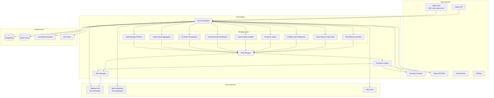

# ULTIMATE TRADING BOT - SYSTEM ARCHITECTURE

## Overview
Complete trading system with ALL capabilities: GMGN integration, Pump.fun sniper, 9 strategies, Telegram bot, Web dashboard.

## System Components



## Data Flow

1. **Data Collection** (30s intervals):
   - GMGN market rank, token info, security metrics
   - Pump.fun new token creation events
   - Solana on-chain data via RPC
   - Jupiter price feeds
   - Social media signals (Twitter, Telegram)

2. **Signal Processing**:
   - 9 parallel strategy engines analyze data
   - Each produces buy/sell signals with confidence scores
   - Risk manager evaluates all signals
   - Position sizing based on portfolio state

3. **Execution**:
   - Order placement via Pump.fun/Jupiter
   - Jito bundler for MEV protection
   - Real-time position tracking
   - Stop-loss/take-profit automation

4. **Monitoring & Alerts**:
   - Telegram notifications for all actions
   - Web dashboard with real-time charts
   - Prometheus metrics collection
   - Grafana dashboards for analytics

## Deployment Architecture

```
Frontend (Vercel)
├── Web Dashboard (Next.js)
├── API Routes (Serverless)
└── Static Assets

Backend (Docker/Kubernetes)
├── Bot Core (Python)
├── PostgreSQL (State)
├── Redis (Cache)
├── Celery (Task Queue)
└── Nginx (Reverse Proxy)

External Services
├── GMGN API
├── Solana RPC
├── Pump.fun Program
├── Telegram Bot API
└── Monitoring Stack
```

## Technology Stack

**Backend**:
- Python 3.11 with asyncio
- FastAPI for REST API
- SQLAlchemy + Alembic for ORM
- Redis for caching
- Celery for async tasks
- Prometheus for metrics

**Frontend**:
- Next.js 14 with TypeScript
- Tailwind CSS for styling
- Chart.js for data visualization
- WebSocket for real-time updates

**Blockchain**:
- Solana Web3.js
- Pump.fun SDK
- GMGN CLI/SDK
- Jupiter SDK

**DevOps**:
- Docker + Docker Compose
- GitHub Actions CI/CD
- Vercel for frontend deployment
- PostgreSQL + Redis cloud
- Grafana + Prometheus monitoring
